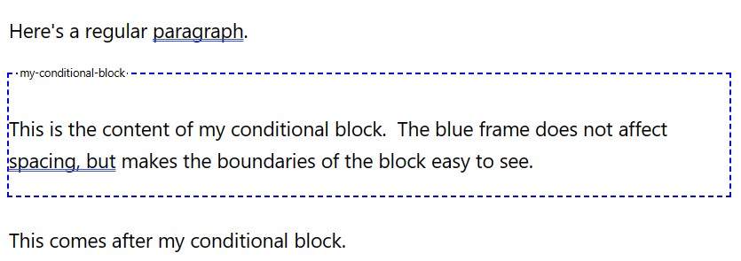

# CBlock: a simple conditional block that can be controlled via code.

The new gutenberg blocks provide new ways of building Wordpress sites, but thus far there does not seem
to be much that makes it easy to make a site dynamic.  This plugin is a very simple step in that direction
for a common use case: enabling action on a block via code. Each cblock is
* always visible in the block editor
* always present in the DOM
* by default not visible in the rendered web page

This is what it looks like in the block editor



The mechanism is simple: a `cblock` block gets rendered into DOM as a `div` with a specific class and
attribute that make it easy to target in code.

The primary advantage this plugin provides over a complete roll-your-own approach is a consistent visualization of the conditional block in the block editor, which can make it easier to allow page editors to work with them.

### Comment

I'm not an expert in gutenberg-fu, but I think the general idea is that your active website will be managed by a React type app that runs on the client side.  In that approach, I imagine this plugin is _not_ how you would go about
managing the state of your app.
But if you have an existing php site, or aren't desiring
to go to a completely React type solution yet, this can be a simple way to bridge the gap.

## Code Examples

The example in the image above generates DOM equivalent to this (don't blame me for the class name, it is auto-generated 😊):

```html
<div class='... wp-block-cblock-block'  blockname='my-conditional-block'>
    <!-- inner content goes here -->
</div>
```

Thus the typical controlpoint is to add a style or css rule targeting
```css
.wp-block-cblock-block[blockname=my-conditional-block]
```

For example, in functions.php, you might have code like this:

```php
    add_action('wp_head', 'maybe_show_content');
    funcdtion maybe_show_content() {
        if ( /* it is Tuesday, or whatever */ ) {
            add_action('wp_footer', 'definitely_show_content');
        }
    }
    function definitely_show_content() {
        echo '<style>
            .wp-block-cblock-block[blockname=my-conditional-block] { display: block !important; }
        </style>';
    }
```

Or, if you are loading some custom javascript, include a snippet like this at the appropriate location:

```javascript
    if ( /* it is Tuesday, or whatever */ ) {
        jQuery('.wp-block-cblock-block[blockname=my-conditional-block]').show();
    }
```

## Plugin Installation

Copy the latest release from [./releases] and upload it as a zip file from the Wordpress Admin > Plugins > Add New > Upload Plugin.

## Build Process

If you wish to fork and build this plugin for yourself:

```bash
    npm install
    npm run build
    npm run plugin-zip
```

